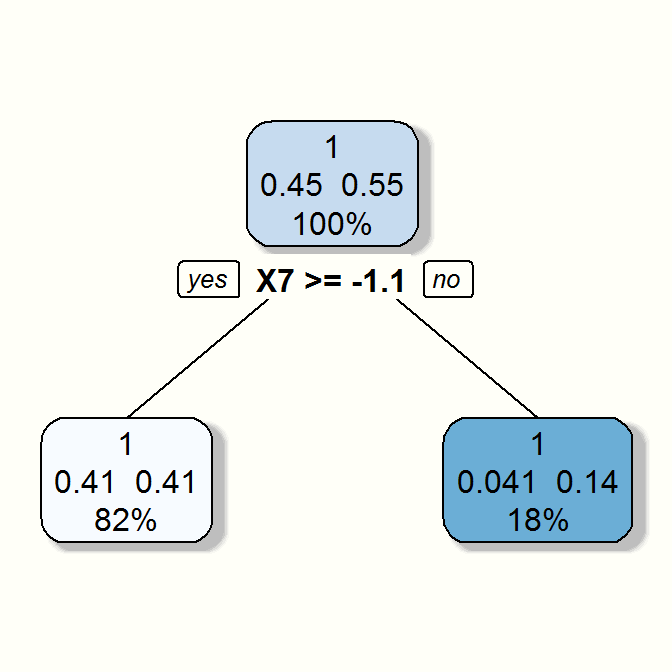
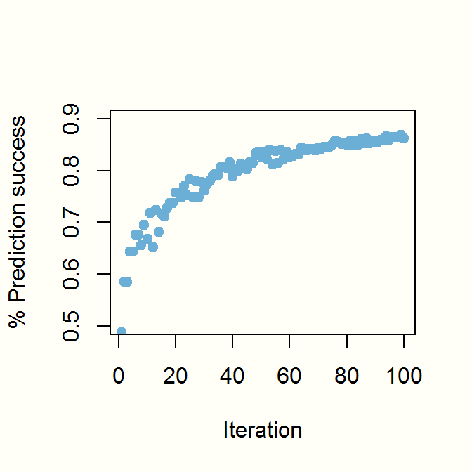
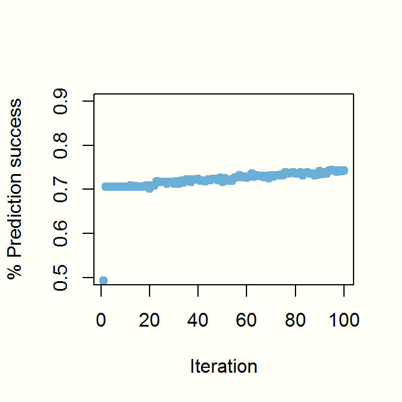
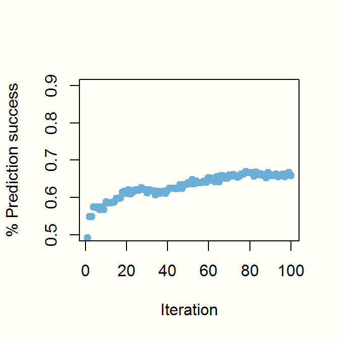

## Data Science Unplugged

<label for="tufte-mn-" class="margin-toggle">&#8853;</label><input type="checkbox" id="tufte-mn-" class="margin-toggle"><span class="marginnote"><span style="display: block;">You can easily <a href="http://www.centralmoment.com">download</a> the R Mardown version of this document and reproduce all my examples on your own. You may just need to install the rpart and rpart.plot packages.</span></span>
When I want to really understand a machine learning or statistical tool, to really get a feel for how it works, I like to step away from the finished package and code the algorithm by hand. Sure, once in production mode I will use a package. Package authors often include helpful options and features that aren't worth my time to reconstruct. Finished packages are often optimized for speed.  But to truly understand the nuts and bolts of what these packages are doing, I often need to first step away from them.  I often like to code these algorithms in base R, Pandas (Python), or SAS/IML. Doing so forces me to understand exactly how the machine learning tool works.

In this document I'll explore additive boosting. As I do so, I'm going to tie my hands, so to speak, and just use base R as much as possible. As far as ground rules go, I will allow myself the use of plotting packages, the [tidyverse](https://www.tidyverse.org/), and other packages as long as they don't mask the fundamental algorithm that I'm trying most to make clear.

The benefits of this manual approach include not only an understanding of the algorithm, but greater knowledge of its assumptions and when it is or isn't likely to work well.  Doing so also gives me great ideas for further improving the algorithm, possibly inventing unique enhancements on my own.


## Boosting and ensemble predictive models

There are multiple flavors of boosting. [Gradient boosting](http://blog.kaggle.com/2017/01/23/a-kaggle-master-explains-gradient-boosting/), for example, is a current favorite over at [Kaggle](https://www.kaggle.com/competitions).  In this document, I'll explore the slightly older additive boosting cousin--called AdaBoost. Readers wanting to learn more ought to pursue Schapire and Freund's [excellent book](https://www.amazon.com/Boosting-Foundations-Algorithms-Adaptive-Computation/dp/0262526034).

All boosting algorithms follow an [ensemble modeling](https://en.wikipedia.org/wiki/Ensemble_learning) approach to generating predictions. Ensemble models are used almost exclusively for prediction (a limitation or caveat that I'll get to later) and generate their predictions only after averaging over dozens or hundreds (i.e., an ensemble) of separate ingredient models or predictions. Ensemble models algorithms are meta-models, in sense. They're "models of models."

## Setting Things Up

I first need some dummy data to which I can apply my homegrown AdaBoost algorithm. The below generates the dummy data used extensively by Ryan Tibshirini and described in one of his [lectures on page 8](http://www.stat.cmu.edu/~ryantibs/datamining/lectures/25-boost.pdf) and in Chapter 10 of the excellent book, [The Elements of Statistical Learning](https://www.amazon.com/Elements-Statistical-Learning-Prediction-Statistics/dp/0387848576). The following chunk generates a data frame, `X`, containing ten normally distributed independent random variables or predictors.  I also generate a binary dependent variable, `Y`, that's only loosely correlated with the predictor variables:

<label for="tufte-mn-" class="margin-toggle">&#8853;</label><input type="checkbox" id="tufte-mn-" class="margin-toggle"><span class="marginnote"><span style="display: block;">Many AdaBoost implimentations require a binary outcome variable be coded as -1 or 1. My example requires 0 or 1 coded outcomes.</span></span>


```r
set.seed(415)
X <- data.frame(matrix(rnorm(10 * 1000, 0, 1), ncol = 10))
X$Y <- ifelse(rowSums(data.frame(lapply(X, function(x) x^2))) > qchisq(0.5, 
    10), 1, 0)
```
The above data will support my development of a "weak learner"--a classification that, on its own, enables an only slightly better-than-chance prediction.  In words, my `Y` variable is built from the sum of my 10 squared independent variables. If the sum exceeds the median of a chi-square distribution having 10 degrees of freedom (which yields a value of 9.3), then `Y=1`; otherwise `Y=0` In general, boosting algorithms show the greatest prediction success when applied using a weak learner like this one.  Further below in this article I'll contrast this with both a strong learner and even a learner containing just random noise.  

I'm working in R, so, to further prepare my work environment I need to load some libraries. I first load rpart, a package for fitting [classification and regression trees](https://cran.r-project.org/web/packages/rpart/vignettes/longintro.pdf) and also rattle and rpart.plot which is helpful for generating nice plots of classification trees like those rpart produces. 


```r
library(rpart)
library(rattle)
library(rpart.plot)
```
So, right at the start here I'm assuming the reader is somewhat familiar with [classification via decision or regression trees](https://www.amazon.com/Classification-Regression-Wadsworth-Statistics-Probability/dp/0412048418) and I won't code a classification tree from scratch in base R.  That would be exhausting and detract from my purpose here. For what it's worth, I could just as easily demonstrate boosting if I employed logistic regression instead of a classification tree. Also, one can apply boosting to standard linear regression models as well as to classification trees. But boosting appears to be most often applied in tree-based settings, so I'll stick with rpart.  

<label for="tufte-mn-" class="margin-toggle">&#8853;</label><input type="checkbox" id="tufte-mn-" class="margin-toggle"><span class="marginnote"><span style="display: block;">As an experiment, the reader could create a boosted logistic regression by inserting the code, &quot;model &lt;- glm(Y ~ X1 + X2 + X3 + X4 + + X5 + X6 + X7 + X8 + X9 + X10, weights=weight, data=X, family='quasibinomial')&quot; in place of the rpart function below. Just recall, however, that the predicted values from such a model are on the logistic scale. So, one would need to modify the predict() function accordingly in order to append the 0/1 predicted values to yhat[[i]].</span></span>


## Boosting described in words--and in simple code
AdaBoost is perhaps the simplest boosting algorithm.  Following Schapire and Freund's [excellent description](https://www.amazon.com/Boosting-Foundations-Algorithms-Adaptive-Computation/dp/0262526034), AdaBoost consists of the following steps:

1. Fit a model to one's data
2. Compute the predicted outcome 
3. Increase the relative weight given to the poorly predicted observations; reduce the relative weight given to successfully predicted outcomes.
4. Wash, rinse, and repeat for n iterations, saving the predicted outcomes from each iteration
4. Compute the winning prediction using a weighted average of the predictions from the n iterations

I implement these steps in the following code chunks. This is the AdaBoost algorithm unplugged. I begin by initializing a few objects for collecting the results. And I initialize a weight variable. This weight variable starts of with identical values for each observation or record in `X`.


```r
# create placeholders for the forecast ensemble
alpha <- vector("list")
yhat <- vector("list")
models <- list()
success.vec <- mean(X$Y)

X$weight <- 1/nrow(X)  # Intitialize a weight vector
```

I next code AdaBoost. I first specify the number of boosted trees or iterations (`niter`) that I want in my ensemble. I then repeatedly estimate a classification tree (using the rpart function), saving the predicted values from each member of the ensemble into `yhat`.  As for the construction of my classification tree and the rpart options, I won't go into a deep explanation. The function options below merely specify that each tree in my ensemble contains a single split with a minimum size of 100 observations per split.  A classification or decision tree with a single split like this is called a decision "stump." 

The AdaBoost algorithm inside the loop below might be best understood by working from the bottom up. Near the end of the algorithm, the final predicted probability (`predicted.prob`) of each observation is a weighted average of the predictions from all 100 trees or members of the ensemble.  The relative weight (`alpha.weight`) given each ingredient prediction is determined by `alpha`.  And the `alpha` for each tree is in turn constructed from each model's logged relative prediction error (`.5*log((1-error)/error)`.  Note that this prediction error is simply 1 minus the sum of the weights for all successfully predicted outcomes (`1- sum(as.numeric(X$Y == yhat[[i]])*X$weight)`).  

By experimenting with different `error` values one can see that an ingredient tree's prediction is given exponentially more weight the higher its prediction success.  For example, if a tree predicts no better than chance (error = .5) then its alpha would be zero. Conversely if a given tree in the ensemble predicts with 100% success (error = 0) then the weight given its prediction would be infinitely high (since `.5*log((1-0)/0) = Inf`). This is an exponential loss function and is the default option in many AdaBoost package implementations. Following this rule, highly predictive models in the ensemble get exponentially more weight than poorly predictive ones. 


```r
set.seed(415)
niter <- 100

for (i in seq(niter)) {
    model <- rpart(Y ~ X1 + X2 + X3 + X4 + +X5 + X6 + X7 + X8 + X9 + X10, data = X, 
        maxdepth = 1, minbucket = 100, cp = -1, xval = 0, weights = weight, 
        method = "class")
    models[[i]] <- model
    yhat[[i]] <- ifelse(predict(model)[, 2] > 0.5, 1, 0)
    error <- 1 - sum(as.numeric(X$Y == yhat[[i]]) * X$weight)
    alpha[[i]] <- 0.5 * log((1 - error)/error)
    weight.adjustment <- ifelse(yhat[[i]] == X$Y, exp(-alpha[[i]]), exp(alpha[[i]]))
    new.unscaled.weight <- X$weight * weight.adjustment
    X$weight <- new.unscaled.weight/sum(new.unscaled.weight)
    
    # create weights for combining iterations in the ensemble
    alpha.weight <- lapply(alpha, function(x) x/sum(unlist(alpha)))
    
    # created a weighted predicted probability from the ensemble, weighted by
    # alpha
    predicted.prob <- rowSums(data.frame(Map("*", yhat, alpha.weight)))
    
    # assign prediction outcome
    predicted <- ifelse(predicted.prob > 0.5, 1, 0)
    
    # record the success progress
    success.rate <- sum(predicted == X$Y)/nrow(X)
    success.vec <- c(success.vec, success.rate)
}
```

The `alpha` term in the code above also informs the weights given to each observation. On close inspection it should be clear that at each iteration of the algorithm, the rows inside `X$weight` that correspond to correctly predicted values of `Y` receive less relative weight.  And weight values corresponding to incorrect predictions receive greater relative weight. The change in observational weights causes the rpart function to generate different classification trees with each iteration.  Each tree chases after those observations that were erroneously predicted during the previous iteration. 

<p><span class="marginnote shownote">
<!--
<div class="figure">-->

<!--
<p class="caption marginnote">-->AdaBoost's first tree starts off with equal weights. Predicted values of 0 for Y go to the left; Predicted values of 1 go to the right. The true proportions are described inside the boxes, e.g., 49% of all `X$Y` values are both predicted to equal zero and have a true value of 0.<!--</p>-->
<!--</div>--></span></p>
To make this clear, I plot the first tree or iteration generated from the above AdaBoost example.  This tree splits on variable `X9`. That is, when starting with equal weight given to all data records, the best variable for splitting successes and failures is `X9`. In this iteration, the model predicts all observations for which X9 >= -1.2 as failures (Y=0).  This makes up 88% of the sample. And the model predicts all other observations (the remaining 12% of the sample) as successes (Y=1). The error for this first iteration is 58.8% (which is .49 + .098) which is somewhat higher than chance prediction.  

The second tree reflects a data frame wherein the observations with poorly predicted values from the first iteration receive greater weight. As a result, the highly weighted observations drive a different classification tree--one that now splits on variable `X4`. In the iterative loop above, this process continues for 98 more iterations. Our AdaBoost ensemble has 100 total classification trees. 

<p><span class="marginnote shownote">
<!--
<div class="figure">-->

<!--
<p class="caption marginnote">-->This is the tree from AdaBoost's second iteration. In this tree and all subsequent trees, the weights differ across the observations and, so, the weighted proportion of correct (and incorrect) observations in each branch begins to change.<!--</p>-->
<!--</div>--></span></p>

It's easy to plot the progress and rate of success of the AdaBoost algorithm as it completes the different iterations. In the next plot we see that the algorithm starts off making successful predictions at a rate somewhat better than chance.  However, over subsequent iterations the algorithm improves and the ensemble produces a successful prediction for 85% of the observations. That's pretty good for a model that started with just weakly correlated predictor values.  Predictions using AdaBoost appear to be a great improvement over the single best-fitting predictive stump with which we started.  

<p><span class="marginnote shownote">
<!--
<div class="figure">-->

<!--
<p class="caption marginnote">-->Prediction success from AdaBoost applied to a WEAK learner. AdaBoost begins with a classificatation just slightly better than chance and gradually improves with more iterations.<!--</p>-->
<!--</div>--></span></p>

It's also interesting to monitor AdaBoost's progress at successfully predicting the individual observations of interest. In the next code chunk below and in the object called `yhat.successes` I record the occasions each record in my data frame was correctly predicted by an AdaBoost tree. Recall that the object `yhat` that I initialized at the beginning is a list object containing 100 vectors--one for each tree in the example above.  And each vector inside `yhat` contains 1000 values--one for each predicted value of `X$Y`.  The object `yhat.successes` below, therefore, records which of AdaBoost iterations successfully predicted each data record. And using `head()` I display the prediction results for the first 6 such observations (in rows) and the first 8 AdaBoost trees or iterations (in columns). One can see that the first, fourth, and fifth observation in this example were correctly predicted in the first classification tree (`X1` column) but these same observations were then unsuccessfully predicted in the second classification tree (`X2`) column. Over subsequent AdaBoost iterations, observations often alternate between being successfully or unsuccessfully predicted as the observation weights change and rpart selects different variables for constructing the classification stump. 


```r
yhat.successes <- sapply(yhat, function(z) z == X$Y)
head(data.frame(yhat.successes)[,1:8])
```

```
##      X1    X2    X3    X4    X5    X6    X7    X8
## 1  TRUE FALSE  TRUE FALSE  TRUE FALSE  TRUE FALSE
## 2 FALSE  TRUE FALSE  TRUE  TRUE  TRUE FALSE  TRUE
## 3 FALSE  TRUE FALSE  TRUE FALSE  TRUE FALSE  TRUE
## 4  TRUE FALSE  TRUE FALSE  TRUE FALSE  TRUE FALSE
## 5  TRUE FALSE  TRUE FALSE  TRUE FALSE  TRUE FALSE
## 6 FALSE  TRUE FALSE  TRUE FALSE  TRUE FALSE  TRUE
```

I note that there was no one single tree or iteration that correctly predicted all or even anything close to 85% of the observations.  In AdaBoost, some trees successfully predict some observations; other trees successfully predict others.  AdaBoost is an ensemble modeling method. The final prediction rate is achieved by averaging over all 100 trees or iterations in the ensemble.  However, the code below confirms that 100% of the observations were correctly predicted *at least once* over the 100 iterations above.  


```r
success.pct <- sum(apply(yhat.successes, 1, function(z) max(z))) / nrow(X) 
success.pct
```

```
## [1] 1
```

Now, I don't show the code for revealing it here, but in this simulated data set, all observations were actually correctly predicted at least once after only SIX AdaBoost iterations.  However, I don't terminate AdaBoost after just six iterations. The values of `alpha` for combining the different tree predictions may not yet be optimized. AdaBoost needs to return to the unsuccessfully predicted observations in iteration number six and further refine their weights.  Rules for deciding when to terminate AdaBoost iterations should balance increased prediction success (a greater number of AdaBoost iterations will improve prediction) with over-fitting (too many iterations will result in a tree ensemble that doesn't generalize well outside this particular data set).  Splitting one's data into training vs. validation samples (or adopting a [k-fold](https://en.wikipedia.org/wiki/Cross-validation_(statistics)) validation) is essential for tuning any boosting algorithm and for determining the ideal number of AdaBoost iterations. 

## When AdaBoost fails--Example #2

To understand the type of occasion when AdaBoost is likely to be most useful, it is helpful to run AdaBoost on different simulated data scenarios. Here below I revise the data generation process I used above.  I now create a dependent or outcome variable (`X$Y`) such that it's very easily classified by just one of the previously generated independent variables (`X1`). The following code generates a strong learner, a data frame containing a variable that very easily predicts the outcome.   


```r
# Generate just one continuous strong learner
X$pr = 1/(1+exp(-X$X1))         # pass X1 through an inv-logit function
X$Y = rbinom(1000,1,X$pr)       # generate a bernoulli response variable
```

I then re-run the same AdaBoost algorithm above for 100 iterations.  Here to the right is the plot of its prediction success.


<p><span class="marginnote shownote">
<!--
<div class="figure">-->

<!--
<p class="caption marginnote">-->Prediction success from AdaBoost using a STRONG learner. Here AdaBoost starts off predicting well but improvement is not as good as it is with the weak learner above.<!--</p>-->
<!--</div>--></span></p>

Comparing this progress plot with the plot from the weak learner, it's clear that AdaBoost's initial prediction success starts off much higher when begun with a strong learner.  However, prediction doesn't improve nearly as quickly and appears to approach an asymptote that's much lower than that for the weak learner.  With the strong learner, AdaBoost's prediction success after 100 iterations approaches around 73%.  By contrast, with the weak learner above, the prediction success approaches 85%.  This difference demonstrates one of AdaBoost's key strengths.  AdaBoost does better with a large number of loosely predictive variables than it does with just a few strongly predictive ones With a great many loosely predictive variables such as in this example, AdaBoost has more opportunity to adjust the weights, to allow different predictor variables to define the stump, and to improve model fit.

## Pushing the limits of AdaBoost--Example #3

Boosting works best when fed with a weak learner like in the first example. However, here's something interesting: AdaBoost will also *appear* to improve prediction even when presented with a learner that's less than weak.  To show this, I next simulate the application of AdaBoost on a "noise learner."  In the code below, I define `X$Y` as completely independent of any of the predictor variables.  Here `X$Y` is now simply the outcome of 1,000 random Bernoulli trials:


```r
# Generate a random dependent variable
set.seed(5)
X$Y = rbinom(1000,1,.5)      # bernoulli response variable
```

Let's run AdaBoost one more time on the noise data above and plot its progress:


<p><span class="marginnote shownote">
<!--
<div class="figure">-->

<!--
<p class="caption marginnote">-->Prediction success from AdaBoost and a NOISE learner. Even with noise data, AdaBoost improves prediction above chance after 100 iterations.<!--</p>-->
<!--</div>--></span></p>

Wow! Even when tasked with predicting random noise, AdaBoost finds better-than-chance prediction success. In this plot to the right, after 100 iterations AdaBoost correctly predicts over 65% of the observations.  And if I were to run AdaBoost indefinitely and well beyond 100 iterations, AdaBoost's prediction success would gradually continue, eventually growing towards 100%. AdaBoost is truly adaptive. It's so good at generating a predictive ensemble that, if allowed to run long enough, it can find predictive gold even when there is none!

## Conslusions for boosting

This highlights yet more strengths and weaknesses of AdaBoost as a prediction algorithm. AdaBoost can take a mere weak learner and, via adapting the data weights, find prediction success from an ensemble far in excess of what one could achieve from a single classification tree alone.  That's a plus.  It's ideal if one's task is to make predictions given a collection of only loosely predictive independent variables.  For example, perhaps one is trying to predict, say, whether a potential oil well contains enough oil to merit extraction. Assume in addition that the seismic data one would normally use for predicting extraction success, while fundamentally accurate and unbiased, is beset with measurement error and background noise. AdaBoost might predict well in such a situation.

But the lesson from the noise learner example should be to never generalize a boosting algorithm's prediction success from a test sample alone. As shown in Example #3, one can achieve prediction success from one's test sample even if the predictor variables bear no (unweighted) relationship with the dependent variable. If I tried to apply the results here to make predictions from an entirely new data set, I would likely fail miserably.  Boosting is prone to over-fitting. One ought to employ cross-validation methods to reduce the risk of wrong generalizations.

My second concern with AdaBoost--and this holds for all ensemble models that I'm aware of--is that while it might be excellent at prediction, AdaBoost is bad at story telling.  What I mean is, it's very difficult to interpret the results of a predictive ensemble. It's hard to tell exactly which variables are most helpful in prediction. Granted, some boosting implementations such as [ada](https://cran.r-project.org/web/packages/ada/ada.pdf) for R or  [sklearn](https://github.com/scikit-learn/scikit-learn) for Python include functions for displaying variable importance.  Quite often, 

>"The measures are based on the number of times a variable is selected for splitting, weighted by the squared improvement to the model as a result of each split, and averaged over all trees"  
[Elith, Leathwick, and Hastie (2008)](http://onlinelibrary.wiley.com/doi/10.1111/j.1365-2656.2008.01390.x/full). 

That sounds intuitive and is indeed helpful. But this doesn't say anything about which cut points or categories of an independent variable make for the most accurate predictions. There's no summary about a variable's predictive direction--whether increases or decreases in a particular independent variable are generally associated with a positive or negative outcome.  In fact, it's entirely possible for a variable's cut-point to change or its predictive direction to reverse over the course of an ensemble's iterations if AdaBoost's weights change enough. And it's not clear to me whether the variables and splits chosen for their predictive performance near the end of the iterations (when the data weights are more extreme and the effective sample size is less) ought to be ranked just as highly as variables and splits selected earlier in the ensemble when the observations are more equality weighted. So, it's hard to tell an intuitive story to a client or one's boss describing exactly which independent variables are most predictive--and how they affect prediction.

Stepping back, I think it's helpful to consider the different purposes or objectives for building machine learning models and to evaluate AdaBoost in that context. Researchers implement machine learning models--including additive boosting--for [a variety of purposes](https://www.dezyre.com/article/types-of-analytics-descriptive-predictive-prescriptive-analytics/209).  And it's important to match one's algorithm with one's modeling purpose.  Some machine learning models are built to better understand or describe the world. This is referred to as "descriptive modeling."  Yet other models are built to help guide or optimize decision making. These models attempt to tell the research what he or she *should* do.  Models for economic policy making come to mind here and are often built for this purpose.  These models are called "prescriptive" or "normative models". Finally, researchers often build models where the main purpose is simply prediction success.  These are referred to as "predictive models". I find AdaBoost and other ensemble models most helpful when the goal is focused on predictive performance and if one doesn't need to tell a detailed story around which of the independent variables contribute (or how they contribute) to the prediction. It's less helpful for other purposes. In this context, a cross-validated AdaBoost model is a helpful modeling framework and a valuable addition to the predictive modelers toolkit. 


